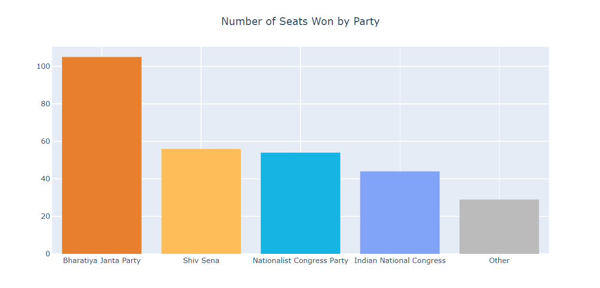
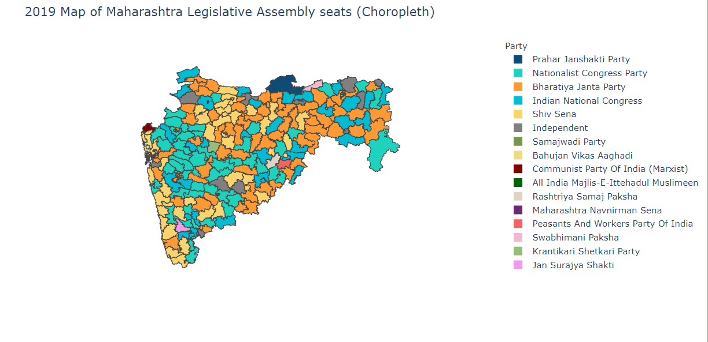

# Visusalising The Legislative Assembly Elections - Maharashtra (2019)

**Jupyter NB Viewer Link for viewing the notebook:** https://nbviewer.jupyter.org/github/pranavbijwe/SimpleVisualiztionForMaharashtraElections2019/blob/master/Simple%20Visualizations%20for%20Maharashtra%20Elections%202019.ipynb

**Aim** : This notebook aims to demonstrate the efficacy of using plotly's easy to use software library to create visualisations for the subject at hand.

**Summary** : The notebook visualizes the Maharashtra Assembly Election results using graphical representations : a histogram, a pie chart, a choropleth, and a cartogram.

The dataset used in this notebook can be found here : https://www.indiavotes.com/ac/info?stateac=30&eid=276  
The shapefiles for the maps used in this notebook can be found here : https://github.com/datameet/maps  

The required geojson files for generating the maps in this notebook were extracted and exported using QGIS, an open-source software that supports viewing, editing, and analysis of geospatial data.

**Result** : This notebook is able to generate interactive visualisations to allow for meaningful insights into the dataset.
